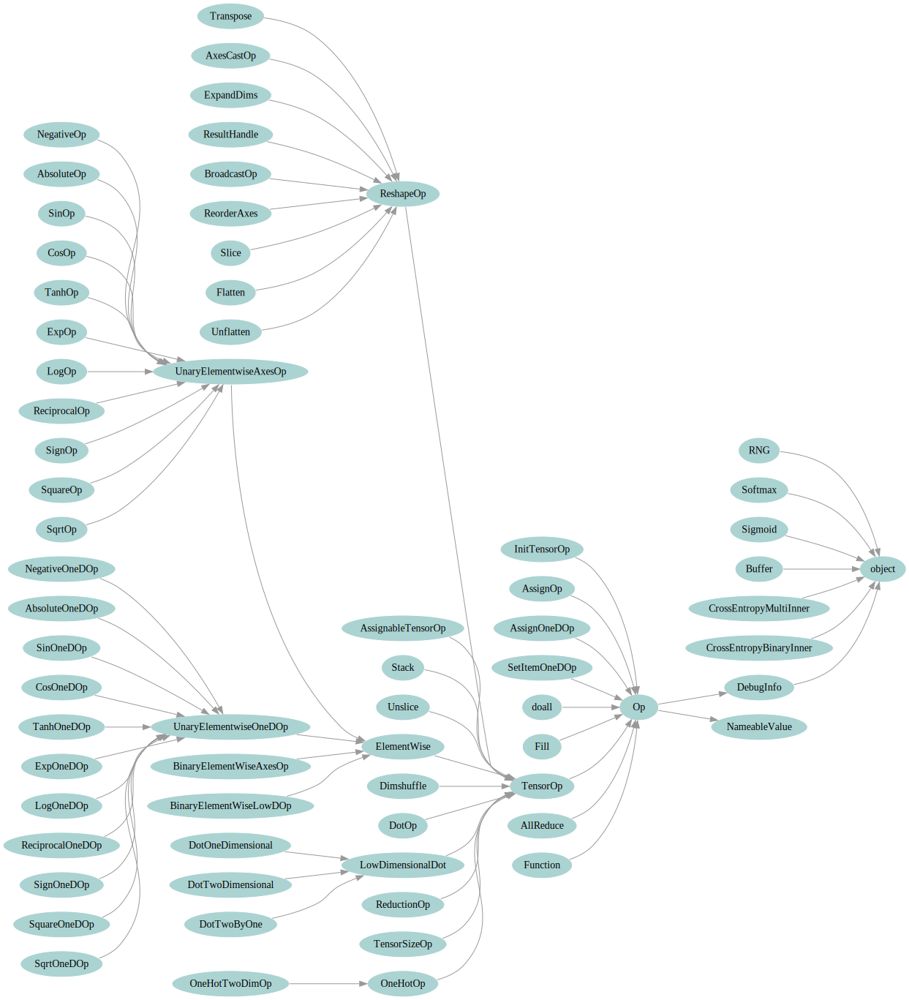

.. ---------------------------------------------------------------------------
.. Copyright 2016 Nervana Systems Inc.
.. Licensed under the Apache License, Version 2.0 (the "License");
.. you may not use this file except in compliance with the License.
.. You may obtain a copy of the License at
..
..      http://www.apache.org/licenses/LICENSE-2.0
..
.. Unless required by applicable law or agreed to in writing, software
.. distributed under the License is distributed on an "AS IS" BASIS,
.. WITHOUT WARRANTIES OR CONDITIONS OF ANY KIND, either express or implied.
.. See the License for the specific language governing permissions and
.. limitations under the License.
.. ---------------------------------------------------------------------------

Building graphs
***************
Frontends (or users who require the flexibility of constructing Nervana Graph ``Op``'s directly) utilize a set of factory functions to construct Nervana Graphs. These factory functions are listed fully in :doc:`api`. But we walk through the common patterns and arguments here. We also discuss the underlying class structure of ``Op`` that is not typically a concern to users or frontends but gives a hierarchical structure that can be helpful.

Nervana Graph Structure
=======================

Data Dependencies
-----------------

``Op``'s primary role is to function as nodes in a directed acyclic graph dependency computation graph. The ``Op`` class's attribute ``args`` is a list containing all upstream dependencies this ``Op`` operates upon. These operate as the directed edges of the graph. 

For example, 

.. code-block:: python

    >>> x = ng.constant(0)
    >>> y = ng.constant(1)
    >>> mysum = ng.add(x, y)
    >>> type(mysum)
    ngraph.op_graph.op_graph.AddOp

    >>> issubclass(mysum, ngraph.op_graph.op_graph.Op)
    True

    >>> mysum.args
    (<AssignableTensorOp(<Const(0)>):4500972432>,
     <AssignableTensorOp(<Const(1)>):4500974224>)

``mysum`` then refers to an instance of the class ``Add`` which is a subclass of ``Op``. ``mysum.args`` is a list containing the ``Ops`` pointed to by the python variables ``x`` and ``y``.

Initializers
------------
In addition to ``args``, there are two other types of edges in Nervana Graphs. Each op has an attribute ``initializers`` which contains a (possibly empty) set of ops needed to execute before any computations occur. To use our running example:

.. code-block:: python

    >>> mysum.initializers
    set()

    >>> x.initializers
    {<InitTensorOp(InitTensorOp_1):4500973392>}

We see here that ``mysum`` doesn't have any initializers because its value is only known at runtime. ``x`` on the other hand is a constant and can and must be initialized before any computations occur. Initializer subgraphs (the ops in ``initializers`` and all upstream ops) themselves contain ``SetItem``, ``Fill``, ``Flatten``, ``ConstantOp`` and other ops to manipulate a tensor to get it ready for computation.

Control Dependencies
--------------------
Finally, consider the following code:

.. code-block:: python

    >>> x = ng.placeholder(initial_value=0, axes=())
    >>> a = ng.assign(x, 5)
    >>> z = x + 1

Here we create a scalar placeholder ``x``, then fill that placeholder with the value ``5``. Then we add one to ``x``. It is not clear initially if ``z`` when evaluated should equal ``1`` or ``6``. In Python at the last line of the previous code block, ``x`` still points to the initial ``placeholder`` with value ``0``. However, In Nervana Graph we believe most users intend the assign operation to occur before the final incrementing by one. Therefore the ordering semantics of ``ng.assign`` happen in accordance with the graph creation order.

In order to enforce these ordering semantics, Nervana Graph accounts for control dependencies between ``Ops`` when ``AssignOps`` are involved. To illustrate:

.. code-block:: python

    >>> z.other_deps
    {<AssignOp(AssignOp_1):4501621200>}

    >>> type(z.other_deps)
    ngraph.util.ordered.OrderedSet

    >>> z.other_deps.pop() is a
    True

All ``Ops`` have an ordered set in ``other_deps`` to contain the ops that must occur first in execution order before this op can be executed *even when those ops are not explicitly captured as data dependencies of that ``Op``*. The ``AddOp`` pointed to by the python variable ``z`` contains a ``other_deps`` control dependency on the ``AssignOp`` to ensure that it occurs first before z is computed.

General properties of ops
=========================

All operational graph ops are instances of the class :py:class:`ngraph.op_graph.op_graph.Op`, which is a subclass of the class :py:class:`ngraph.op_graph.names.NameableValue` and :py:class:`ngraph.op_graph.nodes.DebugInfo`. The former providing ``Ops`` with automatically generated unique names and the latter providing debug info as to the line number and filename where this node was constructed.

In addition to the three graph properties explained above (``args``, 
``initializers``, and ``other_deps``), all ops have the additional attributes:

`axes`
    The axes of the result of the computation. This only needs to be specified 
    by the frontend or user during ``Op`` creation if the default result is not 
    correct or not inferrable for a particular ``Op`` type. The `axes` are also 
    available as a gettable property.

`name`
    A string that can help identify the node during debugging, or when search for a node in a set of nodes.
    Some front ends may also make use of the `name`.  The `name` is a settable property.

`metadata`
    A dictionary of key,value string pairs that can be used to select/filter 
    ops when manipulating them. For example, ``stochastic=dropout`` may be used 
    to indicate groups of trainable variables in conjunction with drop-out.

Some useful properties of ops are:

`filename`
    The file that created the op.

`lineno`
    The line number in the file where the op was created.

`file_info`
    The file and line number formatted for debuggers that support clicking on a file location to edit that location.

Op Hierarchy
============

Users and frontends do not typically need to worry about the implementation details of the various ``Op`` classes. This is why they are hidden behind factory functions.

All Nervana Graph nodes are instances of subclasses of the class ``Op``. This class hierarchy:

* ``Op``: Base class for all ops.
* ``TensorOp (Op)``: Ops that produce a Tensor.
* ``ReshapeOp (TensorOp)``: Ops that change the actual or perceived dimension of a tensor.
* ``ReductionOp (TensorOp)``: Ops that reduce over some axes (e.g. sum).
* ``ElementWise (TensorOp)``: Ops that perform element-wise calculations.
* ``ElementWiseBoolean (ElementWise)``: Boolean element-wise ops.

This is captured in the full class hierarchy in the following figure.

Graph evaluation
================

During computation, the input and output values must be stored somewhere. To create a ``placeholder`` expression in the operational graph, we must import the operational backend symbols and then create the ``placeholder``::

    import ngraph as ng
    from ngraph.frontends.neon as ax

    x = ng.placeholder(axes=ng.make_axes(ax.C, ax.W, ax.H, ax.N))

This will create an ``AllocationOp`` for a ``placeholder`` with the provided list of axes and assign the op to the python variable ``x``.  When the op is used in a graph, the op serves as a Python handle for the tensor stored in the device.

It is important to remember that ``x`` is a Python variable that holds an op.  Therefore, the following code::

    x = x + x

does not directly double the value of the tensor in the ``placeholder``. Instead, the ``__add__`` method is called with
both arguments pointing to the same ``placeholder`` object. This returns a new ``Op`` that is now stored as the python variable ``x``.
On the other hand, to directly modify the value of the ``placeholder``, use::

    ng.SetItem(x, x + x)

Constructing the graph mostly consists of manipulating expressions, so ``SetItem`` is rarely used, except for updating variables at the end of a minibatch. Consider::

    x1 = x + x
    y = x1 * x1 - x

The intermediate value ``x + x`` is only computed once, since the same op is used for both arguments of the multiplication in ``y``.
Furthermore, in this computation, all the computations will automatically be performed in place. If the computation is later modified such that the intermediate value ``x + x`` is needed, the op-graph will automatically adjust the computation's implementation to make the intermediate result ``x + x`` available.  This same flexibility exists with NumPy or PyCUDA, but those implementations always allocate tensors for the intermediate values, relying on Python's garbage collector clean them up; the peak memory usage will be higher and there will be more overhead.

Derivatives
===========

Because ``Ops`` describe computations, we have enough information to compute derivatives, using the ``deriv``
function::

    import ngraph as ng
    from ngraph.frontends import ax

    x = ng.placeholder(axes=ng.make_axes((ax.C, ax.W, ax.H, ax.N)))
    y0 = ng.placeholder(axes=ng.make_axes((ax.Y, ax.N))
    w = ng.Variable(axes=(ng.make_axes((ax.C, ax.W, ax.H, ax.Y))))
    b = ng.Variable(axes=(ng.make_axes((ax.Y,)))
    y = ng.tanh(dot(w, x) + b)
    c = dot((y - y0), (y - y0))
    d = deriv(c, w)

The op `d` will be the op for the derivative of the value of `dc/dw`.

In this example, we knew which ops contain the variables to be trained (e.g. ``w``).  For a more general
optimizer, we could search through all the subexpressions looking for the dependant variables.  This is handled by the ``variables`` method, so ``c.variables()`` would be the list ``[w, b]``.

Graph execution
===============

A *computation* is a subset of ops whose values are desired and corresponds to a callable procedure on a backend.
Users define one or more computations by specifying sets of ops to be computed.  In addition, the transformer
will define four additional procedures:

`allocate`
    Allocate required storage required for all computations.  This includes all allocations for all ops
    marked as `in`.

`initialize`
    Run all initializations.  These are all the `initializers` for the ops needed for the computations.  These
    are analogous to C++ static initializers.

`save`
    Save all persistent state.  These are states with the `persistent` property set.

`restore`
    Restore saved state.
