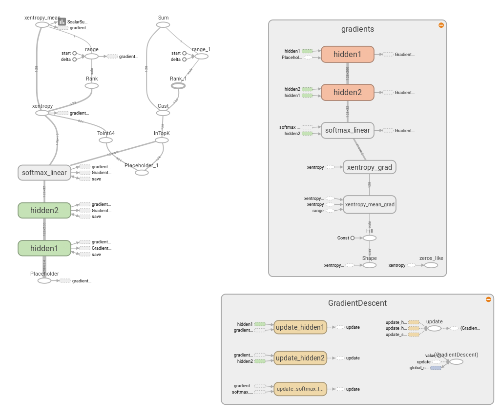
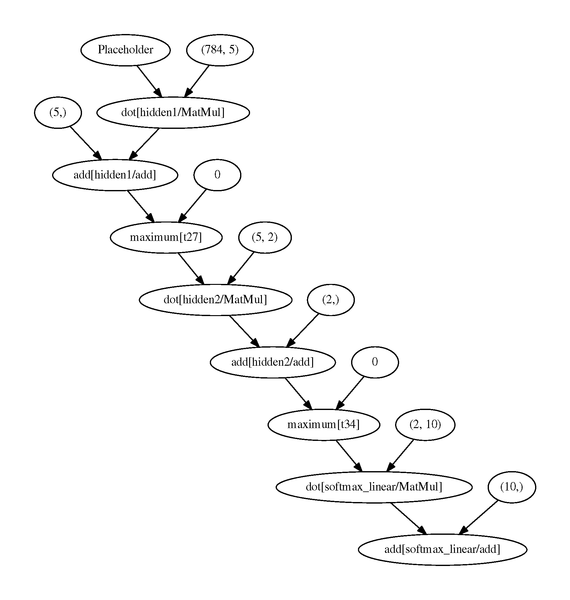
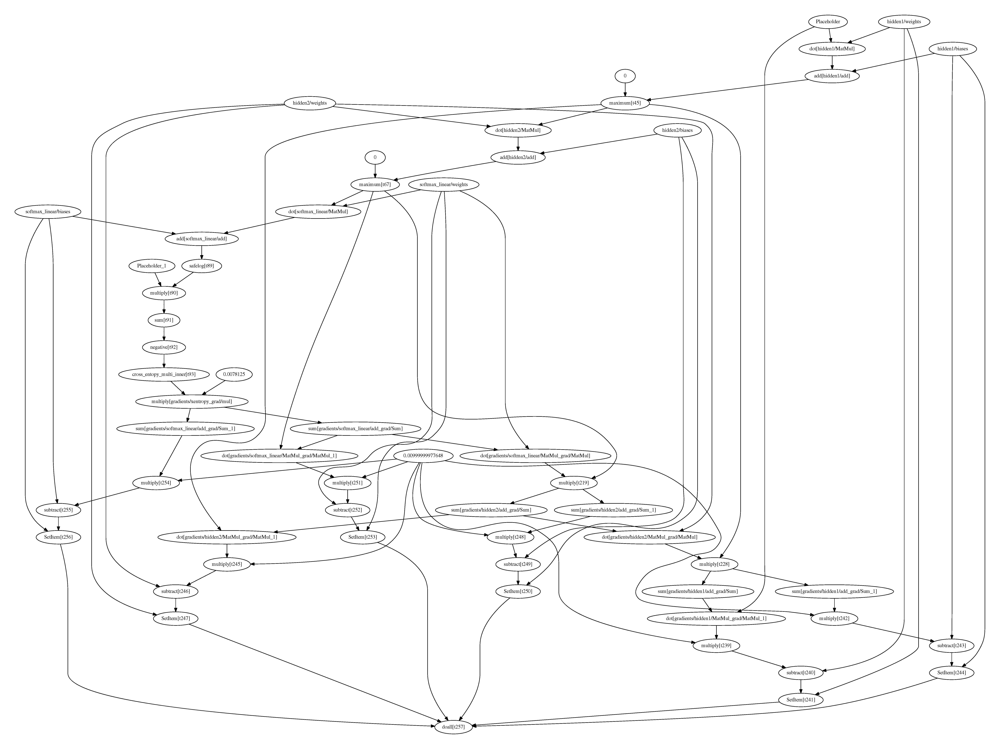

# Run TF's Graph with Neon

## Setup

Tensorflow is currently installed as part of ununoctium:

```
$ cd ununoctium
$ make install
```

## Things to be done with TF

### 1. Save TF's dataflow and weights

TensorFlow provides an [example](https://github.com/tensorflow/tensorflow/tree/master/tensorflow/examples/tutorials/mnist) of training a simple MLP on the MNIST dataset. We made a copy of `fully_connected_feed.py` and modified it by adding code for graph/variable exportation.


#### 1.1 Computation graph

To explicitly save the GradDef object to protobuf, one can add following lines at the end of the training.

```python  
tf.train.write_graph(sess.graph_def, "./", graph.pb.txt, True) # text protobuf  
tf.train.write_graph(sess.graph_def, "./", graph.pb, False) # binary protobuf
```

The text-based compuation graph is saved in the `.pb.txt` file and its binary version is saved in the `.pb` file.

#### 1.2 Variables  

To save model parameters, create a `tf.train.Saver` at the beginning of the training

```python
saver = tf.train.Saver() 
```
and save it periodically or at the end of training.

```python
saver.save(sess, "model.ckpt")
```

The trainable variables are saved in the **checkpoint** (.ckpt) file.

#### 1.3 MetaGraph
The `save()` API also automatically exports a [MetaGraphDef](https://www.tensorflow.org/versions/r0.9/how_tos/meta_graph/index.html) (.meta) file, which contans MetaInfoDef, GraphDef, SaverDef and CollectionDef. 
As explained [here](http://stackoverflow.com/questions/36195454/what-is-the-tensorflow-checkpoint-meta-file#), the `MetaGraphDef` is designed as a serialization format that includes all of the information required to restore a training or inference process (including the GraphDef that describes the dataflow, and additional annotations that describe the variables, input pipelines, and other relevant information).

<!--#### 1.4 Event Summary
To visualize the dataflow or monitor the change of status, one needs to use the summary operations. For example, to visualize the change of `cost` value Create a summary op before training

```python
tf.scalar_summary('cost', cost)
summary_op = tf.merge_all_summaries()
```
and ocasionally save the info to disk

```python

```-->


### 2 Training

Run the training stript `tf_benchmark/mnist/fully_connected_feed.py`

```
$ cd tf_benchmark/mnist/
$ python fully_connected_feed.py
```
### 3. Visualize the graph

The graph can be visualized with TensorBoard.

```
$ tensorboard --logdir=. & firefox http://0.0.0.0:6006
```



The GraphDef actually contains several sub-graphs for different purpose: variable initilization, model inference (fprop), gradient calculation/descent (bprop) and serilization. 
The initilization graph is executated only once before training, while the sub-graphs of inference, gradient calculation/descent are executed for each minibatch optimization. 


## Evaluate a TF Model with Neon

For inference only application, we need to mannually identify the last op used in inference, which is `softmax_linear/add` for this example, to extract the inference graph. 
The inference graph includes all operators that leads to this op.

### 1. Combine protobuf and checkpoint

We need both computation graph and trained parameters for model inference, which are saved in the protobuf (.pb) and checkpoint (.ckpt) file respectiviely. 
However, for some applications, loading one file is more convenient.
In addition, the model parameters (variables) would not change any more and can be converted to constant values. 

TensorFlow provides a convenient tool [freeze_graph](https://github.com/tensorflow/tensorflow/blob/master/tensorflow/python/tools/freeze_graph.py) to combine two files into a single file, in which the variables are converted to constant. An example of freezing a trained mnist graph is as follows:

```
(.venv)$ python freeze_graph.py \
  --input_graph=graph.pb.txt \
  --input_checkpoint=model.ckpt \
  --output_graph=graph_froze.pb \
  --output_node_names=softmax_linear/add
```
Note that the `--output_node_names` option is the name of the last operation for inference, which is currently manually identified on TensorBoard. 

We provide bash script inside each example folder for convenience. 
Simply call `./freeze_graph.sh` inside each folder should work.

### 2. Execute the frozen graph with Neon

Now we can convert the frozen graph into Neon's graph and execute it.

```
(.venv)$ python inference_mnist_mlp.py --pb_file='mnist/graph_froze.pb'
``` 

The computation graph is displayed via graphviz library:



## Training a TF Model with Neon

We can also train the model from scratch with Neon's graph backend.

```
(.venv)$ python train_mnist_mlp.py --pb_file='mnist/graph.pb' --loss_node='xentropy_mean'
```

The protobuf file `mnist/graph.pb` contains separate graphs for variable initialization, variable update (fprop/bprop) and serilization.
The `loss_node` is the node to calculate the loss value, which is currently mannualy identified.

The assembled frop/bprop graph can be visualized as follows:



To get similar result as TF, the most important part is the variable initilization.

